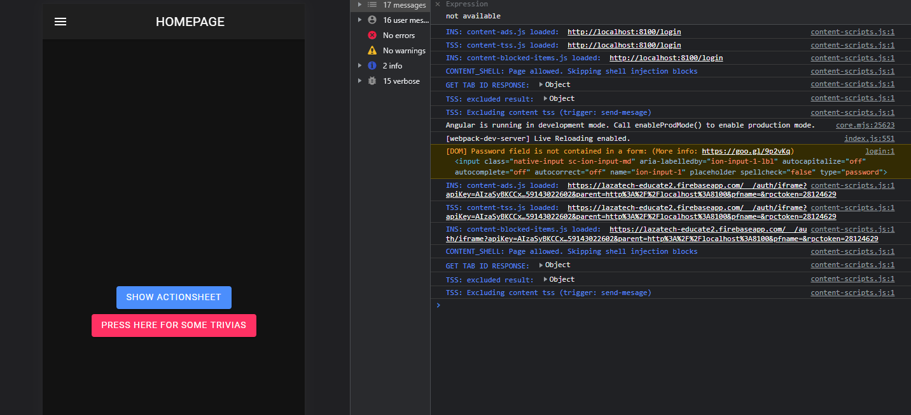

# Ionic_LogIn_Register

An activity website project to create a log in and register page using Ionic framework

# UI Screenshots Sample:

###### For Home Page in Sample Form

<pre>            Android 		 		  Windows 				IOS</pre>

###### For Sign Up

<pre>            Android 		 		  Windows 				IOS</pre>

For Log In

<pre>            Android 		 		  Windows 				IOS</pre>

###### For Forgot Password

<pre>            Android 		 		  Windows 				IOS</pre>

**Notes:**
All fields on the register and login page has an error warning message if the user leave it blank. Just like what the image below displays:

### Additional Features:

**Side menu bar on the home page**

**Action Sheet on the homepage**

**LogIn Auth Page:**

From the image above, you can see that after inserting the log in credentials of a user, the authentication script will authenticate whether the credentials exists on the firebase user database. See from the image below;

**Register page Authentication**

The user will have to insert his/her credentials and click the create account button to register with the app and save it to the firebase database. After creating an account, the credentials were sent to the database as shown below;

The image below shows the configuration that connects the app to the firebase database for authentication;

**
Trivia Api**

The api used on this app is the trivia api where it provide the app with a large number of trivia from the database of Open Trivia Database.

**Video Demo**

